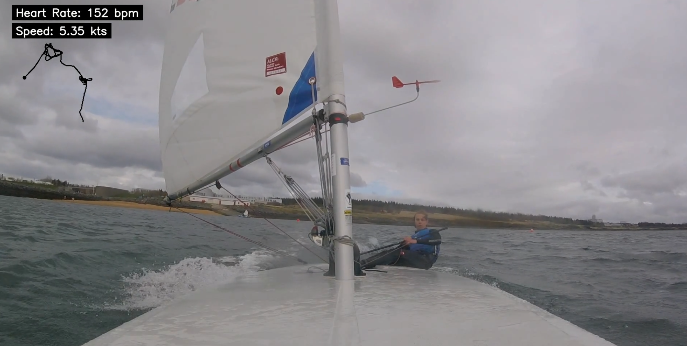

# tcx-video-overlay

This script overlays a video on top of a map using the GPS data from a `tcx` file. The `tcx` file is a file format that contains GPS data from a workout. The script uses the GPS data to create a map with the route and then overlays the video on top of it. The output is a video with the overlay. The script is written in Python and uses the `opencv` library to overlay the video. The reason for this script is to be able to quickly create a video with the route of a workout and the video of the workout, the tcx overlay can display data such as speed, distance, heart rate, latitude, longitude, etc.





## Usage

Create a virtual environment and install the requirements
```bash
python3 -m venv venv
source venv/bin/activate
pip install -r requirements.txt
```

Create a directory called `data` and place the `tcx` file and the `mp4` file in it. If you have multiple files, you can place them in the `data` directory and the script will process all of them in the order they are (sorted by name).

Run the script
```bash
python3 main.py
```

The script will create a directory called `output` with the overlayed videos. You will be asked to confirm the concatenation of the videos if there are multiple files.

## Documentation

The script uses the `tcx` file to extract the GPS data and the `mp4` file to extract the video. The GPS data is used to create a map with the route and the video is overlayed on top of it. The output is a video with the overlay. The `tcx_extractor.py` file contains the code to extract the GPS data, it will do so dynamically, so even if the `tcx` file has more or less data, it will still work. The `video.py` file contains the code to overlay the video on top of the map. The `main.py` file contains the code to run the script. The code is written in a modular way so it is easy to add more functionality.
